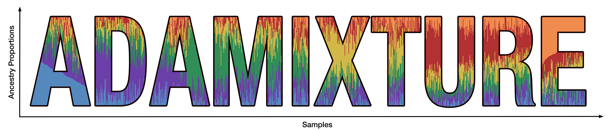
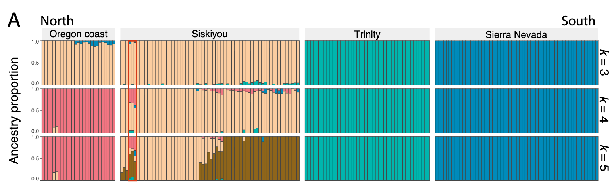

<p align="center">
  
</p>

<h1 align="center">ADAMIXTURE Showcase</h1>

<p align="center">
  <strong>A curated collection of real-world research, ecological discoveries, and biobank-scale genomics powered by ADAMIXTURE.</strong>
</p>

<p align="center">
  <a href="https://ai-sandbox.github.io/adamixture-showcase/"></a>
  <a href="https://github.com/AI-sandbox/ADAMIXTURE"></a>
  <a href="https://pypi.org/project/adamixture/"></a>
  <a href="https://doi.org/10.1093/bioinformatics/btag236"></a>
</p>

---

🌐 **Visit the Interactive Showcase Website:**  
👉 **[https://ai-sandbox.github.io/adamixture-showcase/](https://ai-sandbox.github.io/adamixture-showcase/)**

---

## 📖 About this Showcase

[ADAMIXTURE](https://github.com/AI-sandbox/ADAMIXTURE) provides an ultra-fast, GPU-accelerated alternative to traditional ADMIXTURE for biobank-scale and population-wide genetic clustering. 

This repository documents how researchers across diverse scientific domains—ranging from human biobanks to wildlife conservation and plant landscape genetics—use ADAMIXTURE in their peer-reviewed papers, preprints, and computational pipelines.

---

## 🌟 Featured Spotlight: Pitcher Plant Metacommunity (*Darlingtonia californica*)

<p align="center">
  
</p>

* **Title:** *Connectivity and dispersal mode shape the landscape genetics of a carnivorous pitcher plant-arthropod metacommunity*
* **Authors:** Nonno Hasegawa, Asa E. Conover, Matin Miryeganeh, David W. Armitage
* **Preprint:** [bioRxiv (2026.08.09.743144)](https://doi.org/10.64898/2026.08.09.743144)
* **Organism:** *Darlingtonia californica* (Carnivorous cobra lily) & associated obligate arthropods (*Metriocnemus edwardsi*, *Sarraceniopus darlingtoniae*)
* **Genomic Dataset:** 19,166 nuclear SNPs across 199 plant individuals sampled across Oregon and Northern California.
* **ADAMIXTURE Configuration:** Evaluated across $K = 2 \dots 15$ with 5-fold cross-validation, confirming $K = 3 - 4$ as optimal regional clusters.
* **Key Finding:** Uncovered sharp regional genetic differentiation and limited gene flow across geographic margins, confirming isolation by landscape resistance and the central-marginal hypothesis in non-model organisms.

---

## 📚 Curated Studies & Integrations

| Field | Publication / Project | Organism / Dataset | Authors | Link |
| :--- | :--- | :--- | :--- | :--- |
| 🌿 **Ecology & Landscape Genetics** | *Connectivity and dispersal mode shape the landscape genetics of a carnivorous pitcher plant-arthropod metacommunity* | *Darlingtonia californica* (19,166 SNPs, 199 ind.) | Hasegawa et al. (2026) | [bioRxiv](https://doi.org/10.64898/2026.08.09.743144) |
| 🧬 **Human & Biobank Scaling** | *ADAMIXTURE: adaptive first-order optimization for biobank-scale genetic clustering* | Human 1000G & UKB Scale (500k ind. × 500k SNPs) | Saurina-i-Ricos et al. (2026) | [Bioinformatics](https://doi.org/10.1093/bioinformatics/btag236) |
| 🧬 **Fine-Scale Population Structure** | *Fine-Scale Ancestry Dissection in Oceanian and Pacific Cohorts* | Oceanian & Indigenous Pacific cohorts | Saurina-i-Ricos et al. (2026) | [Oxford Academic](https://doi.org/10.1093/bioinformatics/btag236) |
| ⚙️ **Platform Integration** | *JanusX: Scalable GWAS & Genomic Selection Platform* | High-throughput cohort stratification engine | JanusX Consortium | [GitHub](https://github.com/AI-sandbox/ADAMIXTURE) |

---

## 🚀 How to Add Your Paper or Project

We welcome contributions from researchers and developers worldwide! If you used ADAMIXTURE in your research, thesis, or pipeline:

### Option 1: Open a GitHub Issue (Easiest)
1. Go to the [**Submit Use Case**](https://github.com/AI-sandbox/adamixture-showcase/issues/new?template=submit_use_case.yml) issue template.
2. Fill in your paper title, authors, DOI/link, organism, and brief notes on how ADAMIXTURE was used.
3. Paste or attach your admixture barplot / visualization.
4. We will add it to the website and repository!

### Option 2: Submit a Pull Request
1. Fork this repository.
2. Add your paper to the table in `README.md` and into `index.html` under `<div class="cases-grid">`.
3. Add any relevant figures to `assets/img/`.
4. Open a Pull Request!

---

## 📜 How to Cite ADAMIXTURE

If you use ADAMIXTURE in your work, please cite:

```bibtex
@article{saurinaricos2026adamixture,
  title     = {ADAMIXTURE: adaptive first-order optimization for biobank-scale genetic clustering},
  author    = {Saurina-i-Ric{\'o}s, Joan and Mas Montserrat, Daniel and Ioannidis, Alexander G.},
  journal   = {Bioinformatics},
  volume    = {42},
  number    = {Supplement\_1},
  pages     = {btag236},
  year      = {2026},
  publisher = {Oxford University Press},
  doi       = {10.1093/bioinformatics/btag236}
}
```

---

<p align="center">
  Developed with ❤️ by the <a href="https://github.com/AI-sandbox">AI-sandbox</a> team & Stanford University.
</p>